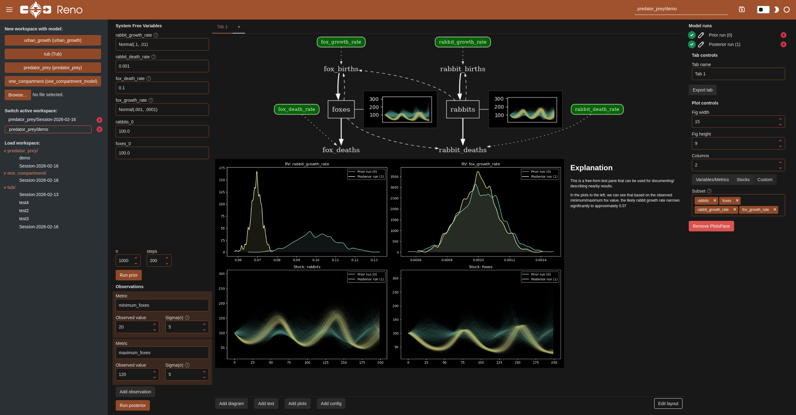
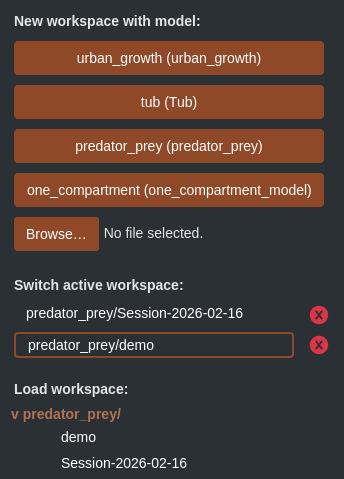
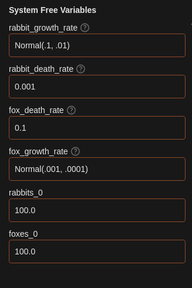

Model Explorer UI
#################

Reno comes with a `Panel <https://panel.holoviz.org>`_ web application for
experimenting with models and constructing mini narrative dashboards around
specific results.

Running
=======

Reno installs with a ``reno`` command, which runs the panel server (by default on port 5006)

The full set of CLI args can be found by running ``reno -h``:

.. code-block::

    usage: reno [-h] [--version] [--workspace-path WORKSPACE_PATH] [--url-root-path ROOT_PATH] [--port PORT] [--address ADDRESS] [--liveness-check] [--websocket-origin WEBSOCKET_ORIGIN]

    options:
      -h, --help            show this help message and exit
      --version             Print out Reno library version.
      --workspace-path WORKSPACE_PATH
                            Where to store and load saved explorer workspaces and models from.
      --url-root-path ROOT_PATH
                            Root path the application is being served on when behind a reverse proxy.
      --port PORT           What port to run the server on.
      --address ADDRESS     What address to listen on for HTTP requests.
      --liveness-check      Flag to host a liveness endpoint at /liveness.
      --websocket-origin WEBSOCKET_ORIGIN
                            Host that can connect to the websocket, localhost by default.

The ``--workspace-path`` argument refers to a cache or save directory to use for
persisting a particular workspace session/explorer views. By default this is set to
``./work_sessions``. Inside the workspace path directory, any Reno model files
saved within the ``models/`` directory will populate new workspace buttons in the
upper left of the interface to allow quickly starting new workspace.

To populate this directory with Reno's packaged example models, one could run:

.. code-block::

    python -c "from reno.examples.lotka_volterra import predator_prey; predator_prey.save('work_sessions/models/predator_prey.json')"
    python -c "from reno.examples.one_compartment import one_compartment_model; one_compartment_model.save('work_sessions/models/one_compartment.json')"
    python -c "from reno.examples.tub import tub; tub.save('work_sessions/models/tub.json')"
    python -c "from reno.examples.urban_growth import urban_growth; urban_growth.save('work_sessions/models/urban_growth.json')"

Interface
=========

Workspace Management
--------------------

The left sidebar contains three sections for creating, switching, and loading
workspaces. A workspace is an individual exploration interface for a particular
model. The buttons along the top (corresponding to any found models in the
workspace directory ``models/`` folder) create a new active workspace for the
specified model. A new model can be uploaded and used by clicking on the browse
button and selecting your local model json file.

Active workspaces are all workspaces currently open in memory - this middle
section can be used for switching back and forth between several models or
explorations. Use the x buttons to close them out. Note that workspaces are not
automatically saved, so be sure to use the save button in the top right in the
header of the interface. (The textbox to the left of this button can be used for
changing the path and name of the saved session.)

Any previously saved workspace shows up in a file-explorer-like view in the
bottom of the workspace management section. Clicking on any of these will reload
that workspace into your active workspaces, and populate the main view.

Model Configuration
-------------------

Parameterizing the model is done in the System Free Variables section. Every
free variable/initial stock condition gets a corresponding textbox, which
accepts either direct values like ``42``, ``13.7``, or can parse any string of
Reno's lisp-like equation syntax. This syntax is shown on the :ref:`math in
reno` page, and corresponding syntax for any given operation is listed on the
corresponding op page from :py:mod:`reno.ops`, labeled as "String notation".

Building up a tab
=================

Saving/loading
==============
