Visualizations
##############

Diagrams
========

Stock and flow diagrams are a useful way to visually check that component references are
set up as expected, with corresponding lines between flow, variables, and stock
based on what other equations they're used in. The basic method for generating a
stock and flow diagram is the :py:func:`model.graph() <reno.model.Model.graph>`
function, which as shown on the getting started page might look something like
this:

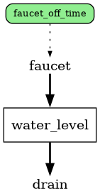

Highly complex models with lots of variables can render a simplified diagram by
either excluding variables entirely with ``exclude_vars=True``, or hiding a
specific set of variables with names listed in ``exclude_var_names=["my_var1",
..."]``.

Highly linear models that don't have many branches or cycles can be oriented
left-to-right instead of top-down by passing ``lr=True``.

Sparklines
----------

Mini "sparkline" plots can be added to the sides of various component types
within the stock and flow diagrams to quickly get an overview of component values
in the context of where they sit in the overall system. The three parameters to
control this are ``sparklines``, ``sparkdensities``, and ``sparkall``.

Running with ``sparklines=True`` will add a sparkline plot to every stock in the
system.

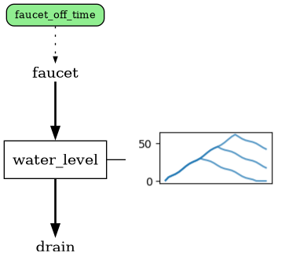

``sparkall=True`` will further add plots for every flow:

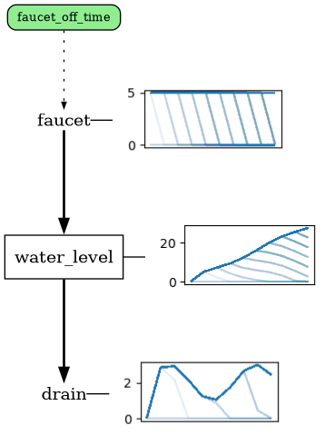

Finally, ``sparkdensities=True`` will add histograms/density plots for all
variables (mostly only useful when variables have probability distributions
associated with them either directly or upstream.)

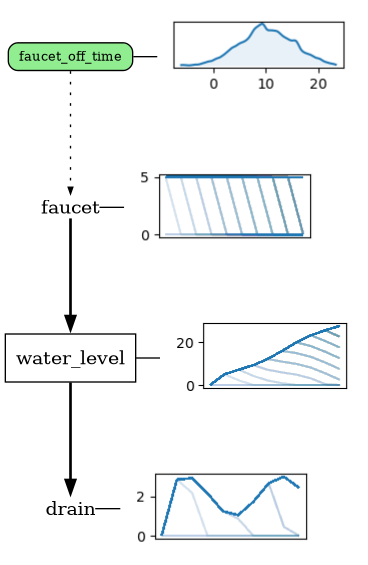

By default, the sparkline plots will be based on the last simulation run that
completed. To use specific runs or render multiple runs at the same time, pass
the traces to the ``traces`` array parameter

Groups/Color groups
-------------------

Every tracked reference optionally has both a :py:attr:`group
<reno.components.TrackedReference.group>` and :py:attr:`cgroup
<reno.components.TrackedReference.cgroup>` attribute, which influences how they
appear in the diagrams. The ``group`` attribute is used to encourage graphviz to
visually tighten up/keep elements within the same group closer to each other.
This is primarily done by straightening and shortening any connections between
elements of a group where possible.

In this example, suppose a variable applies to two different flows:

.. code-block:: python

    import reno as r

    m = r.Model()
    with m:
        s1 = r.Stock()
        v1 = r.Variable()
        f1, f2 = r.Flow(v1), r.Flow(v1)
        f1 >> s1 >> f2

The stock/flow diagram looks like this:

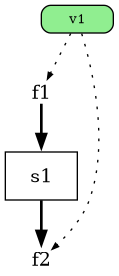

If we assign the same group name to the variable and the second flow, it
straightens out the connection between ``v1`` and ``f2``:

.. code-block:: python

    import reno as r

    m = r.Model()
    with m:
        s1 = r.Stock()
        v1 = r.Variable(group="test")
        f1, f2 = r.Flow(v1), r.Flow(v1, group="test")
        f1 >> s1 >> f2

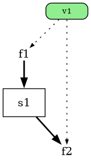

``cgroup`` is a "color group" attribute intended to make it easier to change
colors of specific sets of references in the diagram without influencing layout.

Either groups or color groups can be colored from a :py:func:`model.graph() <reno.model.Model.graph>` call with the ``group_colors`` attribute:

.. code-block:: python

    m.graph(group_colors={"test":"#4499AA"})

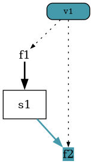

Settings can be defined on models to hide specific groups or set default
colors for designated groups, making them potentially easier to interpret
when given to someone else.

These settings can also be specified manually on a :py:func:`model.graph() <reno.model.Model.graph>` call with the ``hide_groups``, ``show_groups`` (to override a model's ``default_hide_groups`` setting), and ``group_colors``.

Get a list of the groups/cgroups on a model with the :py:attr:`groups
<reno.model.Model.groups>` property.

Universe
--------

To limit diagram rendering to only a specific set of components (beyond just
hiding certain variables), directly pass a list of tracked references to include
in the diagram to the ``universe`` parameter. This is useful if a very large
system has multiple "areas" and you want to individually render each area
separately.

Latex
=====

As shown on the getting started page, an interactive latex output listing all
component equations can be generated with the :py:func:`model.latex()
<reno.model.Model.latex>` function:

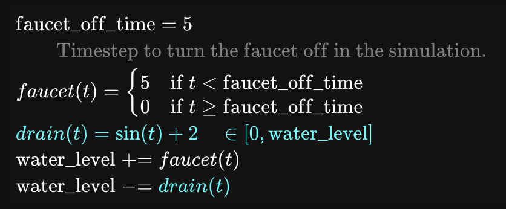

The latex view can also be useful for debugging systems by passing a ``t``
parameter - this will include the values of every reference at the specified
timestep:

.. code-block:: python

    tub.latex(t=5)

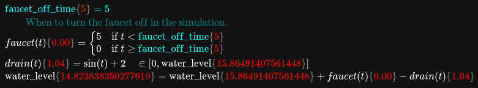

Plots
=====

Multi-trace plots
-----------------

The :py:func:`reno.viz.plot_trace_refs` function allows comparing specified
components across multiple different simulation runs.

.. code-block:: python

    trace = predator_prey(
        rabbit_growth_rate=0.07,
        rabbit_death_rate=0.0001,
        fox_death_rate=0.01,
        fox_growth_rate=1e-05,
        rabbits_0=200.0,
        foxes_0=700.0,
        steps=2000
    )
    reno.plot_trace_refs(predator_prey, {"run": trace}, ref_list=["foxes", predator_prey.rabbits])

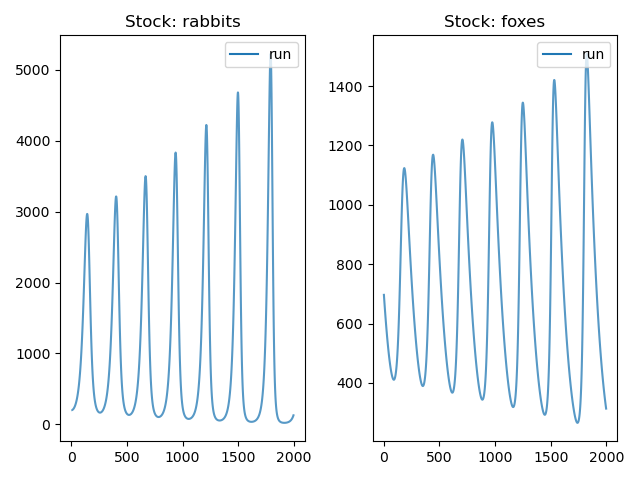

Single axis plots
-----------------

A common figure type used for system dynamics models compares multiple
components on the same plot axes. The logic for labelling the axes is a bit
tricky, so :py:func:`reno.viz.plot_refs_single_axis` handles it for you:

.. code-block:: python

    reno.plot_refs_single_axis(trace, [predator_prey.foxes, predator_prey.rabbits])

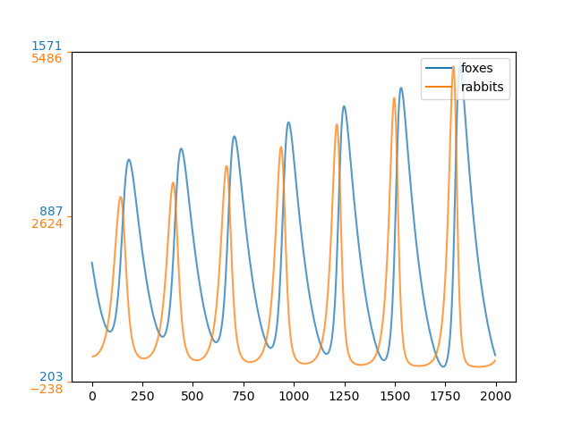
